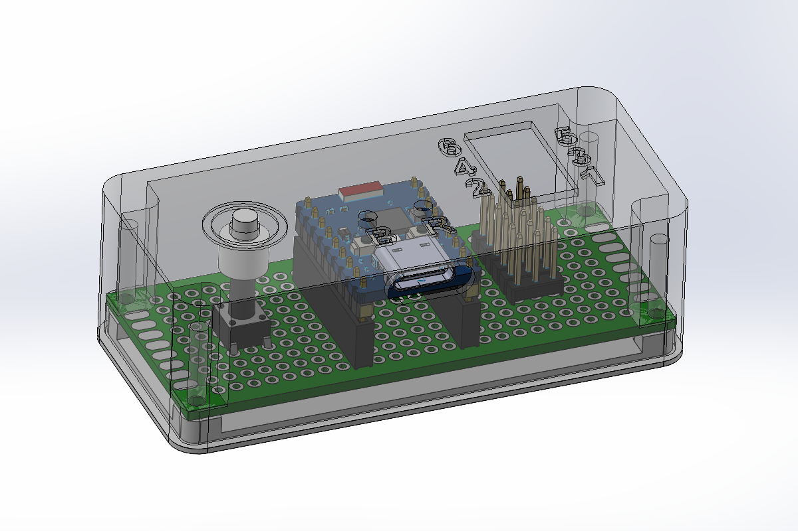

# multi-zigbee-soil-sensor

A Zigbee device which reports multiple humidity levels from capacitive soil sensors.

The device enters pairing mode at first boot and waits indefinitely to join a network. Then it enters deep sleep after each reporting (though it is not meant to be battery powered). The onboard LED is red at boot, blue after connecting to the network and green after reporting.

## Bill of Materials

- ESP32-C6
- HW-390 capacitive soil sensors
- push button (not used yet)
- connection pins

## Configuration

In `main.cpp` file:

- `MIN_READ`: analog value for 0% humidity
- `MAX_READ`: analog value for 100% humidity
- `ADC_1`, `ADC_2`, ...: pins for the capacitive sensors
- `TIME_TO_SLEEP_S`: duration of the deep sleep

Adapt the number of sensor instances for your need.

## Zigbee2Mqtt

Copy the [converter file](./zigbee2mqtt/custom_converters/StrangePlanet-PlantsSensor.js) to your system and restart Z2M before adding the device to the network.

You will need to change the endpoints configuration if you changed the number of sensors.

## License

Creative Commons 3.0 BY-SA