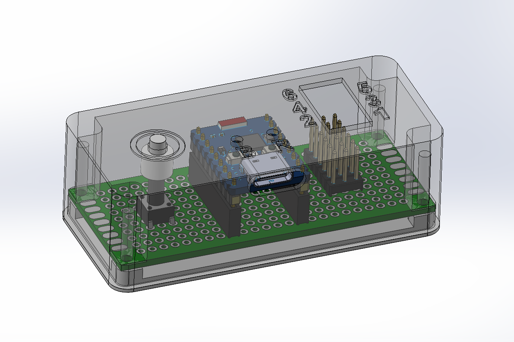

# multi-zigbee-soil-sensor

A Zigbee device which reports multiple humidity levels from capacitive soil sensors.

The device enters pairing mode at first boot and waits indefinitely to join a network. Then it reports humidity levels every 5 minutes. The onboard LED is red at boot, green after connecting to the network and blue during reporting.

## Bill of Materials

- ESP32-C6
- HW-390 capacitive soil sensors
- push button (not used yet)
- connection pins

## Configuration

In `main.cpp` file:

- `MIN_READ`: analog value for 0% humidity
- `MAX_READ`: analog value for 100% humidity
- `ADC_1`, `ADC_2`, ...: pins for the capacitive sensors
- `REPORT_INTERVAL_S`: interval between each report

Adapt the number of sensor instances for your need.

## Zigbee2Mqtt

Copy the [converter file](./zigbee2mqtt/custom_converters/StrangePlanet-PlantsSensor.js) to your system and restart Z2M before adding the device to the network.

You will need to change the endpoints configuration if you changed the number of sensors.

## License

Creative Commons 3.0 BY-SA